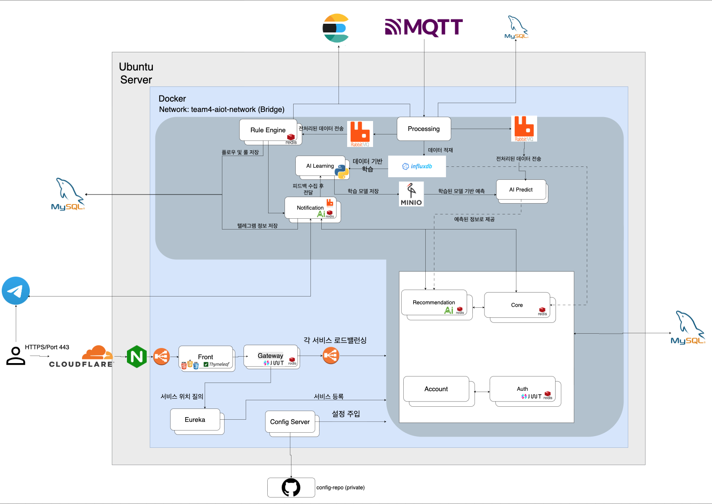

   
   

  <h1>🚨 4iren (4팀)</h1>
  
<b>공간 융합형 데이터 기반 AIoT 지능형 강의실 환경 제어 플랫폼</b>

  
10주간 함께 만들어가는 인공지능 기반 환경 관리 솔루션 프로젝트입니다.

 

  <a href="https://4iren.site">🖥️ 홈페이지</a> &nbsp; | &nbsp; <a href="https://github.com/nhnacademy-aiot3-4iren/4iren-wiki/wiki">📄 Team Wiki</a> &nbsp; | &nbsp; <a href="https://www.erdcloud.com/d/cMAWTm4FoZ56yLm6o">📚 ERD Cloud</a>

 

---

## 🚨 왜 4iren인가

> 위험을 가장 먼저 감지하고 경보를 울리는 **사이렌(Siren)** 처럼,
> **4iren**은 교육 공간의 공기질 이상과 에너지 낭비를 가장 먼저 감지해 알리고, 스스로 판단해 대응하는 AIoT 플랫폼입니다.

### 😮‍💨 이런 문제, 익숙하지 않으신가요?

- 실내 공기질이 나빠져도 **아무도 바로 알아채지 못합니다.**
- 수업이 끝난 강의실의 냉난방기가 **켜진 채로 방치**됩니다.
- 환기를 유지할지 냉방을 유지할지, 매번 **사람이 날씨까지 확인하며 판단**해야 합니다.
- 강의실마다 크기·창문 유무·단열 상태·밀집도가 달라 **일률적인 규칙만으로는 최적화가 불가능**합니다.
- 관리해야 할 강의실이 많아질수록 **담당자 없는 사각지대**가 생깁니다.

### 🎯 서비스 목표

교육 시설에 설치된 IoT 센서를 실시간으로 관제하고, **규칙 기반 자동화**와 **LLM·ML 기반 지능형 판단**을 결합해 사람이 매번 개입하지 않아도 실내 환경이 최적 상태로 유지되도록 만드는 **플러그앤플레이(Plug & Play) AIoT 플랫폼**입니다.

> 센서·MQTT 연동만 마치면, 강의실마다 규칙을 새로 코딩할 필요 없이 머신러닝이 해당 공간의 물리적 특성에 맞춰 스스로 학습하고 최적화됩니다.

**🏫 타겟 고객** — 여러 강의실·실습실을 운영하며 공기질·에너지 관리를 체계화하고 싶은 교육기관 (대학, 학원, 부트캠프 등)

### 💡 핵심 가치

| 가치 | 설명 |
|---|---|
| ⚡ **실시간성** | 센서 패킷 인입부터 알림·브리핑 반영까지 저지연 처리 (MQTT → RabbitMQ → 비동기 파이프라인) |
| 🧩 **자동화의 2단계 구조** | 사람이 정한 명시적 규칙(임계치·복합조건 룰 엔진)과, 상황을 스스로 해석해 선제적으로 판단하는 AI 예측·추천을 모두 제공 |
| 🌦️ **맥락 있는 판단** | 실내 센서 데이터뿐 아니라 실시간 외부 날씨까지 결합해 "왜 이 조치가 필요한지"를 자연어로 설명 |
| 🧠 **공간 도메인 적응** | 강의실마다 독립된 ML 모델이 물리적 특성과 이용 집단의 선호를 자동 학습 — 하드코딩 없이 공간별로 스스로 최적화 |

---

## 📅 Project Info

**프로젝트 기간 : 10주 (2026.07.06 ~ 2026.09.22)**

  <ul>
    <li><b>1~2주차:</b> 기획 및 MSA 아키텍처 설계</li>
    <li><b>3~9주차:</b> 기능 구현, 데이터 파이프라인 통합 및 AI 모델 고도화</li>
    <li><b>10주차:</b> 통합 테스트, 시스템 이중화 검증 및 최종 발표</li>
  </ul>

--- 

  <h3> 🔥 Team 4 Members (9명)</h3>

  <table>
    <tr>
      <td align="center"><a href="https://github.com/pp0ng"> 김태희</a> Rule Engine</td>
      <td align="center"><a href="https://github.com/shinjunsik"> 신준식</a> Infra / CI·CD</td>
      <td align="center"><a href="https://github.com/yooncy123"> 윤채영</a> Recommendation / Core</td>
      <td align="center"><a href="https://github.com/Uoo-uu"> 유대연</a> Recommendation / Core</td>
      <td align="center"><a href="https://github.com/jeongmin26"> 이정민</a> Auth / Account</td>
    </tr>
  </table>

  <table>
    <tr>
      <td align="center"><a href="https://github.com/onyune"> 전유진</a> AI Predict / Notification</td>
      <td align="center"><a href="https://github.com/likeironbasic"> 최이건</a> AI Learning</td>
      <td align="center"><a href="https://github.com/hjiwon203"> 황지원</a> Rule Engine</td>
      <td align="center"><a href="https://github.com/JAENA216"> 전재나</a> Front / Auth</td>
    </tr>
  </table>

 

---

## 🛠️ Tech Stack

  <h3>Backend & Frameworks</h3>
  
  
  
  
  
  
  
  <h3>Databases & Message Brokers</h3>
  
  
  
  
  
  
  

  <h3>Infrastructure & Tools</h3>
  
  
  
  
  
  

  <h3>Frontend & AI</h3>
  
  
  
  

---

## 📂 Repositories

<i>⚠️ 추후 다시 업데이트 예정입니다.</i>

<h3>🌐 Gateway & Infra</h3>

<table align="center">
  <tr><th align="center">Repository</th><th align="center">설명</th></tr>
  <tr><td align="center"><a href="https://github.com/nhnacademy-aiot3-4iren/4iren-gateway">4iren-gateway</a></td><td align="center">게이트웨이</td></tr>
  <tr><td align="center"><a href="https://github.com/nhnacademy-aiot3-4iren/4iren-eureka">4iren-eureka</a></td><td align="center">유레카</td></tr>
</table>

<h3>🖥️ Front</h3>

<table align="center">
  <tr><th align="center">Repository</th><th align="center">설명</th></tr>
  <tr><td align="center"><a href="https://github.com/nhnacademy-aiot3-4iren/4iren-front-server">4iren-front</a></td><td align="center">프론트</td></tr>
</table>

<h3>⚙️ Core Services</h3>

<table align="center">
  <tr>
    <th align="center">Repository</th>
    <th align="center">설명</th>
    <th>세부기능</th>
  </tr>
  <tr><td align="center"><a href="https://github.com/nhnacademy-aiot3-4iren/4iren-rule-engine">4iren-rule-engine</a></td><td align="center">룰 엔진</td><td><a href="https://github.com/nhnacademy-aiot3-4iren/4iren-wiki/wiki/Rule%E2%80%90engine-%E2%80%90%EC%84%B8%EB%B6%80%EA%B8%B0%EB%8A%A5">Rule Engine 세부기능</a></td></tr>
  <tr><td align="center"><a href="https://github.com/nhnacademy-aiot3-4iren/4iren-processing">4iren-processing</a></td><td align="center">데이터 전처리</td><td><a href="https://github.com/nhnacademy-aiot3-4iren/4iren-wiki/wiki/%EC%84%BC%EC%84%9C-%EB%8D%B0%EC%9D%B4%ED%84%B0-%EC%88%98%EC%A7%91-%EB%B0%8F-%EC%A0%84%EC%B2%98%EB%A6%AC-%EC%84%9C%EB%B9%84%EC%8A%A4-(Processing-Service)">Processing 세부기능</a></td></tr>
  <tr><td align="center"><a href="https://github.com/nhnacademy-aiot3-4iren/4iren-core-api">4iren-core</a></td><td align="center">핵심 비즈니스</td><td><a href="https://github.com/nhnacademy-aiot3-4iren/4iren-wiki/wiki/Core-%E2%80%90-%EC%84%B8%EB%B6%80%EA%B8%B0%EB%8A%A5">Core 세부기능</a></td></tr>
  <tr><td align="center"><a href="https://github.com/nhnacademy-aiot3-4iren/4iren-recommendation-api">4iren-recommendation</a></td><td align="center">LLM 처리</td><td><a href="https://github.com/nhnacademy-aiot3-4iren/4iren-wiki/wiki/Recommendation-%E2%80%90-%EC%84%B8%EB%B6%80%EA%B8%B0%EB%8A%A5">Recommendation 세부기능</a></td></tr>
</table>

<h3>🔐 Auth & Account</h3>

<table align="center">
  <tr><th align="center">Repository</th><th align="center">설명</th><th>세부기능</th></tr>
  <tr><td align="center"><a href="https://github.com/nhnacademy-aiot3-4iren/4iren-auth-api">4iren-auth</a></td><td align="center">인증/인가</td><td><a href="https://github.com/nhnacademy-aiot3-4iren/4iren-wiki/wiki/Auth-%E2%80%90-%EC%84%B8%EB%B6%80%EA%B8%B0%EB%8A%A5">Auth 세부기능</a></td></tr>
  <tr><td align="center"><a href="https://github.com/nhnacademy-aiot3-4iren/4iren-account-api">4iren-account</a></td><td align="center">유저 CRUD</td><td><a href="https://github.com/nhnacademy-aiot3-4iren/4iren-wiki/wiki/Account-%E2%80%90-%EC%84%B8%EB%B6%80%EA%B8%B0%EB%8A%A5">Account 세부기능</a></td></tr>
</table>

<h3>🔔 Notification</h3>

<table align="center">
  <tr><th align="center">Repository</th><th align="center">설명</th><th>세부기능</th></tr>
  <tr><td align="center"><a href="https://github.com/nhnacademy-aiot3-4iren/4iren-notification-service">4iren-notification</a></td><td align="center">알림(텔레그램) 처리</td><td><a href="https://github.com/nhnacademy-aiot3-4iren/4iren-wiki/wiki/Notification-API-%E2%80%90-%EC%84%B8%EB%B6%80%EA%B8%B0%EB%8A%A5">Notification 세부기능</a></td></tr>
</table>

<h3>🤖 AI</h3>

<table align="center">
  <tr><th align="center">Repository</th><th align="center">설명</th><th>세부기능</th></tr>
  <tr><td align="center"><a href="https://github.com/nhnacademy-aiot3-4iren/4iren-notification-service">4iren-AI-learning</a></td><td align="center">업데이트 예정</td><td><a href="https://github.com/nhnacademy-aiot3-4iren/4iren-wiki/wiki/AI%E2%80%90Learning-%E2%80%90-%EC%84%B8%EB%B6%80%EA%B8%B0%EB%8A%A5">AI Learning 세부기능</a></td></tr>
  <tr><td align="center"><a href="https://github.com/nhnacademy-aiot3-4iren/4iren-notification-service">4iren-AI-predict</a></td><td align="center">업데이트 예정</td><td><a href="https://github.com/nhnacademy-aiot3-4iren/4iren-wiki/wiki/AI-Predict-API-%E2%80%90-%EC%84%B8%EB%B6%80%EA%B8%B0%EB%8A%A5">AI Predict 세부기능</a></td></tr>
</table>

 

---

## Architecture Overview

   
    

> ⚠️ Environment API는 Core API로 명칭 변경됨 (2026-07 기준)

---

## 요구사항

기능 요구사항

| 영역 | 요구사항 |
|---|---|
| 실시간 관제 | 강의실별 센서 데이터(온도·습도·CO₂) 실시간 조회 |
| 실시간 관제 | 외부 날씨 연동 및 실내외 비교 뷰 제공 |
| 웰컴 브리핑 | 도어 센서 최초 개방 감지 시, 밤새 축적된 공기질 + 당일 날씨 종합 브리핑 자동 발송 |
| 정밀 재실 분석 | CO₂ 농도 기울기(상승/하강 속도)를 ML 피처로 활용한 재실·밀집도 추정 |
| 공간 도메인 적응 | 강의실별 물리적 특성(환기 효율, 냉방 속도 등) 독립 학습 |
| 집단 맞춤 학습 | 사용자 피드백 누적 학습으로 강의실별 최적 환경 지표 자동 도출 |
| 룰 엔진 | 센서 임계치 기반 및 복합조건(다중 지표 조합) 자동화 룰 |
| 룰 엔진 | 다중 룰 충돌 시 우선순위 기반 처리 |
| 알림 | 관리자 대상 실시간 이상탐지·임계치 알림 (전용 봇) |
| 알림 | 일반 사용자 대상 브리핑·추천·피드백 요청 (전용 봇) |
| 자연어 질의응답 | "지금 환기해도 될까?" 등 실내외 데이터 종합 자연어 답변 |
| 피드백 수집 | 인라인 키보드 + 자유 텍스트 피드백 수집, 환경 스냅샷과 결합해 학습 데이터로 적재 |
| 단기 트렌드 예측 | 30분 후 CO₂·온도 예상치 및 임계치 도달 예상 시간 제공 |
| 에너지 관리 | 공강 시간 등 빈 공간 지속 감지 시 기기 대기 모드 전환 권장 |
| 리포트 | 시간별 센서 통계 집계, 주간/월간 환경 요약 리포트 |
| 이력 조회 | LLM 추천 이력 및 사용자 수락/거절 반응 조회 |
| 조직 관리 | 강의실 구독 요청 → 관리자 승인 워크플로우 |
| 조직 관리 | 역할(관리자/일반 구성원)별 접근 권한 차등 |
| 계정 | 로그인, JWT 기반 인증/인가 |

비기능 요구사항

| 구분 | 요구사항 |
|---|---|
| 실시간성 | 웹훅/이벤트 수신은 즉시 응답, 실제 처리(LLM 호출 등)는 비동기로 분리 |
| 장애 격리 | 외부 서비스(LLM 등) 장애가 알림·발송 기능 전체를 막지 않음 (서킷브레이커/폴백) |
| 서비스 독립성 | 서비스별 독립 DB/스키마 사용, 타 서비스 DB 직접 접근 금지 (Database-per-Service) |
| 확장성 | 새로운 강의실 추가 시 스키마·코드 변경 없이 모델이 자동 적응 (플러그앤플레이) |
| 확장성 | 센서 항목 추가 시에도 핵심 파이프라인 변경 최소화 |
| 비용 효율 | LLM 호출은 목적에 따라 경량 모델(의도 분류)과 고성능 모델(답변 합성)로 분리 |
| 성능 | 반복 조회되는 표시용 참조 데이터는 캐시로 DB/API 호출 병목 방지 |
| 보안 | 봇 차단·계정 비활성화 시 알림 대상에서 자동 제외 |
| 데이터 무결성 | 동일 스키마 내 테이블 간 참조 무결성을 실제 제약조건(FK)으로 보장 |
| 데이터 일관성 | 이벤트 기반 동기화 데이터는 최종적 일관성을 전제, 순서 역전 시 stale 이벤트 방어 로직 적용 |
| 오버엔지니어링 회피 | 실제 필요성이 확인되기 전까지 불필요한 스키마 확장·과도한 동기화 인프라 도입 지양 |

---

## 제공 기능

- **실시간 환경 관제**: 강의실별 센서 데이터 실시간 조회, 외부 날씨 비교 뷰
- **지능형 웰컴 브리핑**: 도어 센서 트리거 기반 맥락 인지형 자동 브리핑
- **정밀 재실·밀집도 분석**: 시계열 기울기 기반 ML 추정
- **공간 도메인 적응 학습**: 강의실별 독립 모델을 통한 자동 환경 최적화
- **룰 기반 자동화**: 임계치/복합조건 룰, 우선순위 관리
- **텔레그램 알림 에이전트**: 관리자용(발송 전용)/사용자용(양방향 에이전트) 이원화 봇
- **자연어 질의응답 및 피드백 루프**: 상황 인지형 답변 + 학습용 피드백 수집
- **단기 트렌드 예측 및 에너지 관리 트리거**: 선제적 환기 추천, 유휴 공간 자동 절전 제안
- **리포트 및 이력 조회**: 통계 집계, 추천 이력/반응 조회
- **조직 및 접근 권한 관리**: 강의실 구독 승인 워크플로우, 역할 기반 권한

